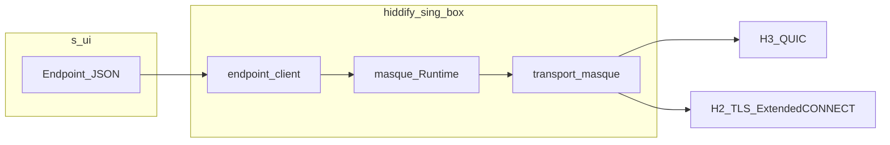

# AGENTS — handoff: MASQUE (sing-box fork + s-ui + стенд)

Документ для ИИ и разработчика: форк **`hiddify-core/hiddify-sing-box`** и стенд **`vendor/s-ui`**. Глобально sing-box не переписывать: правки ядра — только при явном недочёте и с минимальным blast radius.

---

## Проблема и симптомы

**Цель работы:** поднять **пропускную способность и предсказуемость** MASQUE на клиентских путях **H2 / H3**, **CONNECT-UDP**, **CONNECT-stream (TCP)**, **CONNECT-IP**; отслеживать регрессии одним эталонным прогоном (**раздел 15**).

### Производительность (профиль **h3**, основной KPI)

- На удалённом стенде прямой **TCP VPS → iperf** может давать **сотни Mbit/s**, тогда как через **MASQUE H3 + TUN** типичны **десятки Mbit/s** и выраженная **асимметрия upload ≫ download** — узкое место ищем в **клиентском hot path** (TUN **`mixed`/`gvisor`**, CONNECT-stream **HTTP/3**, QUIC receive) и в **серверном relay** (**`endpoint_server.go`**), а не в «отсутствии канала».
- Регрессии по скорости фиксировать **только** по таблице эталонного бенчмарка (**up/down Mbit/s** по каждому профилю), сравнивая прогоны «до/после» на том же VPS и той же версии скрипта.

### H2 и CONNECT-UDP (открытый дефект на стенде)

- **Симптом:** при **`http_layer=h2`** TCP (**CONNECT-stream**) через MASQUE часто **жив и даёт цифры iperf**, а **UDP probe бенча FAIL**: **`dig`** к **`BENCH_IPERF_*`** завершается **`communications error … timed out`**, тогда как при **`http_layer=h3`** для того же запроса типичен **`connection refused`** / ICMP к порту без DNS — признак доставки датаграммы по CONNECT-UDP (**§15.3a**).
- В логах клиента при UDP есть **`masque_http_layer_chosen … connect_udp=1`** — рукопожатие CONNECT-UDP по H2 проходит, **обрыв на датаплейне** (ответный поток HTTP/2 после релея UDP по смыслу расходится с поведением **masque-go** на QUIC, где при ошибке **`conn.Read`** явно закрывается поток).
- На клиенте для H2 CONNECT-UDP выровнено с CONNECT-stream/H3 использование **`setMasqueAuthorizationHeader`** (при **`client_basic_username`** не отправлять только Bearer по **`server_token`**).

### CONNECT-IP

- Профили **`connect-ip-h3` / `connect-ip-h2`** на том же эталонном бенче часто **FAIL без TCP цифр**: сессия **`open_ip_session_*`**, политика authority/template на сервере, версия ядра на VPS — **`docker logs masque-perf-remote-client`**, деплой **§«Деплой s-ui»**.

### Прочее

- **`box.log` Hiddify:** ошибки **DNS** через **`dns-remote` → masque** и **`masque h3 dataplane connect-stream`** часто **общего происхождения** с поломанным TCP/stream dataplane, а не «отдельный DNS-баг» (**раздел 4 логов**).
- **`extended connect not supported by peer`** — H2 без **RFC 8441** на пути к MASQUE (**раздел 3**).
- Не путать с **iperf-хостом**: локальный **`iperf3 -u`** на **163.5.180.181** к **127.0.0.1** и baseline **VPS → iperf** в скрипте отделяют **firewall/UDP снаружи** от **CONNECT-UDP внутри VPN**.

Ориентиры в коде при perf-правках:

- **HTTP/3 CONNECT-stream upload**: **`writeConnectStreamPipeUpload`**, **`h2PipeWriteDL`**, **`h3MasqueBufferedPipeWriter`** (**`transport/masque/transport.go`**).
- **Download:** **`h3MasqueResponseReadCloser`**.
- **CONNECT-IP:** **`ConnectIPObservabilitySnapshot`**, **`netstack_adapter.go`**, **`connectIPUDPPacketConn.WriteTo`**.
- **H2 CONNECT-UDP relay:** **`transport/masque/h2_connect_udp_server.go`** (**`ServeH2ConnectUDP`**).

Исторический контекст relay на сервере (буферы **512 KiB**, **`TCP_NODELAY`**), MTU bench **1500** — **`docs/masque/`**.

### Пример снимка матрицы (цифры меняются от прогона к прогону)

Цепочка эталона: Docker **`masque-perf-remote-client`** → **`masque-PEX`** → VPS **193.233.216.26:4438** → TCP **163.5.180.181:5201**. Иллюстрация **2026-05-15**:

| profile | status | up | down | udp |
|---------|--------|-----|------|-----|
| **h3** | OK | ≈28–35 | ≈8–15 | OK (`udp_delivered_icmp_refused`) |
| **h2** | FAIL* | есть | есть | FAIL (`dig` timeout) |
| **connect-ip-*** | FAIL | — | — | — |

\*На профиле **h2** при живом TCP чаще всего виноват **FAIL UDP probe** (CONNECT-UDP по HTTP/2), см. **«Проблема и симптомы»**.

---

## Две фазы работ

### Фаза A — корректность (оставшиеся дыры)

1. **H2 CONNECT-UDP:** см. **«Проблема и симптомы»** — закрыть расхождение с H3 на UDP probe; при недоступности CONNECT-UDP проверять **RFC 8441** на MASQUE-порту (**раздел 3**).
2. **CONNECT-IP**: **`open_ip_session_success`**, политика authority/template на сервере; выровнять клиент/VPS после **`endpoint_server.go`** / **`transport/masque`** — см. **§15.6**.
3. Временное **`BENCH_UDP_PROBE=0`** в env лаборатории — только локальная диагностика TCP; **не** использовать как KPI успеха (**раздел 15**).
4. **DNS через masque**, **`box.log`**, **s-ui** JSON — разделы 3, 7.

### Фаза B — скорость (**основной фокус на профиле h3**)

1. **`pprof`** (CPU/block/mutex) на клиенте во время **upload** и отдельно **`iperf -R` / download**; сравнить долю **`transport/masque`**, QUIC/http3, TUN.
2. Убрать лишние копирования и блокировки на hot path; проверить **flow control / размер чанков** H3 DATA и поведение **`streamConn.Read`** при обратном направлении.
3. Сервер: асимметрия relay **request body → TCP** vs **TCP → response body** (**`relayTCPBidirectional`**, **`relayCopyBuffered`** в **`endpoint_server.go`**).
4. Сравнение на том же VPS с **другим outbound** (VLESS и т.д.) и **таблица эталонного бенчмарка §15** — фиксировать **`http_layer`**, **`tun.stack`**, MTU.

---

## Деплой свежего s-ui перед удалённым тестированием

Панель поднимает **sing-box с тем ядром**, которое зашито в **Dockerfile** образа. Если менялись **`hiddify-core/hiddify-sing-box`** (клиент/сервер MASQUE, CONNECT-IP, шаблоны) или нужно совпадение версии с локальным деревом — **перед эталонным прогоном §15.1** задеплойте образ на VPS.

**Рекомендуемый способ** (локальная сборка образа → отправка на сервер → **`compose up --no-build`**):

1. **`vendor/s-ui`**: скопировать **`run.env.example` → `run.env`** (не коммитить), задать **`SUI_RUN_HOST`**, **`SUI_RUN_USER`** и прочее по комментариям в **`run.env.example`**.
2. Из каталога **`vendor/s-ui`**:

```powershell
cd c:\Users\qwerty\git\hiddify-app\vendor\s-ui
python run.py deploy
```

Подробности команд (**`verify`**, **`certbot`**, **`binary`**, **`redeploy-binary`**) — **`vendor/s-ui/AGENTS.md`**, **`run.py`**, **`deploy/TLS.md`**.

**Когда деплоить обязательно:**

- Правки **`protocol/masque/endpoint_server.go`**, серверной авторизации, шаблонов **`/masque/*`**, CONNECT-IP termination.
- Смена тегов Go / сборки sing-box в **Dockerfile** панели.
- На бенче **connect-ip** видны устаревшие симптомы (политика, authority, старый бинарник), не совпадающие с локальным кодом.

После деплоя: полный **`Benchmark-Masque.ps1`** (**§15.1**) или **`docker logs`** контейнера панели на VPS — убедиться, что слушает нужный порт и core стартовал без ошибки.

---

## Быстрая карта путей

| Область | Путь |
|---------|------|
| Корень монорепо | `c:\Users\qwerty\git\hiddify-app\` |
| Форк sing-box | `hiddify-core\hiddify-sing-box\` |
| Portable клиент | `portable\windows-x64\Hiddify\` · **`hiddify_portable_data\data\box.log`** · **`current-config.json`** |
| Сборка portable | `scripts\build-windows-portable.ps1` (**`-Mode Full`** / **`CoreRefresh`**) |
| Панель / подписка | `vendor\s-ui\` |
| Hiddify core JSON | `hiddify-core\v2\config\` |
| Flutter | `lib\` |
| Docker perf lab | `docker\masque-perf-lab\` |

Документация панели и полей sing-box: **`docs/masque/s-ui.md`**, **`docs/masque/MASQUE-SINGBOX-CONFIG.md`**.

---

## Логи клиента (`box.log`)

Путь по умолчанию: **`portable/windows-x64/Hiddify/hiddify_portable_data/data/box.log`** (при **`log.output`** в конфиге).

Типичные маркеры:

- **`dns-remote`** / **`context canceled`** — пока dataplane masque не отвечает вовремя.
- **`masque h3 dataplane connect-stream`** / **`H3 error`** — обрыв или ошибка CONNECT-stream.
- **`extended connect not supported by peer`** — H2 без RFC 8441 на пути к MASQUE (раздел 3).
- Успешный **vless** health-check в том же логе **не** доказывает работу MASQUE.

**Сборка portable:** закрыть **`Hiddify.exe`** перед **`robocopy`**; проверять **`tun.mtu`** (на Windows jumbo с portable часто ломает download — в bench **`Import-MasqueHiddifyBenchConfig.ps1`** форсирует **1500**).

---

## Оглавление

Проблема и симптомы · Две фазы (A/B) · Деплой s-ui · Карта путей · Логи … далее по номерам:

1. Цель и границы  
2. Симптомы и метрики (кратко)  
3. Логи → гипотезы  
4. Карта кода MASQUE  
5. Mermaid клиента  
6. Валидация режимов  
7. s-ui и `connect_ip` в подписке  
8. CONNECT-IP / teardown  
9. Тестирование на VPS  
10. Core / Flutter  
11. Сборка libcore и теги  
12. Устаревшие цели  
13. Критерии готовности  
14. Локальные проверки (`go test`, политика таймаутов)  
15. Единственный эталонный бенчмарк (**`Benchmark-Masque.ps1`**, все профили, KPI успеха)  
16. Инварианты безопасности  

---

## 1. Цель и границы

1. **Метрика:** реальная скорость (**upload / download** отдельно), сравнение с другим outbound на том же хосте; фиксировать **`http_layer`**, **`transport_mode`**, **`tcp_transport`**, MTU, QUIC experimental.
2. **Надёжность:** нет «вечных» зависаний без объяснимой ошибки; корректный teardown CONNECT-IP и сессий; предсказуемость при смене инбаундов.
3. **Авторизация MASQUE** (`server_auth`, Bearer/Basic/mTLS): не ломать контракты.
4. Внешний upstream sing-box — только если проблема общая и фикс безопасен для остальных outbounds.

---

## 2. Симптомы и метрики (кратко)

Развёрнутое описание симптомов и текущего дефекта **H2 CONNECT-UDP** — в начале: **«Проблема и симптомы»**.

Приоритет расследования:

1. **Производительность h3**: низкий абсолютный throughput и разрыв **upload ≫ download** при зелёном эталонном бенче (**§15**, **`pprof`** при **`iperf -R`**).
2. Изолировать **`masque-PEX`** (**`route.final`** на него при необходимости).
3. Hot path **`transport/masque/transport.go`** (H3 CONNECT-stream чтение/запись, CONNECT-UDP/IP).
4. **`http_layer` auto** vs **h3** / **h2**.
5. DNS — после подтверждения TCP/stream.
6. Сервер VPS + **`endpoint_server.go`** (асимметрия relay).
7. **`warp_masque`** — отдельно.

---

## 3. Логи: симптомы → гипотезы

**Hiddify:** полный конфиг с balancer и **`dns-remote` → detour** усиливает шум в логе; ошибки DNS и stream чаще всего **одного происхождения** с dataplane masque.

**H2 Extended CONNECT:** путь **`transport/masque/h2_connect_stream.go`**, ошибки через **`ErrTCPConnectStreamFailed`** в **`transport.go`**.

**DNS:** UDP к 53 → **CONNECT-UDP**; TCP (DoT и т.д.) → **`dialTCPStream`** → на H2 нужен Extended CONNECT на пиру (**раздел 3 подробнее в исторических заметках** — детект в **`h2_connect_udp.go`**).

**Кэш http_layer:** **`protocol/masque/http_layer_cache.go`**, **`endpoint_client.go`**.

**Фоллбек слой:** **`IsMasqueHTTPLayerSwitchableFailure`**; при отсутствии **`http_layer_fallback.go`** в checkout — **`go build ./...`** в модуле форка.

---

## 4. Карта кода MASQUE (полные пути)

### 4.1 Опции

| Назначение | Путь |
|------------|------|
| `MasqueEndpointOptions`, константы режимов | `hiddify-core\hiddify-sing-box\option\masque.go` |

### 4.2 Протокол

| Назначение | Путь |
|------------|------|
| Валидация, правила `connect_ip` / `tcp_transport` | `hiddify-core\hiddify-sing-box\protocol\masque\endpoint.go` |
| Клиент, dial, http_layer | `...\protocol\masque\endpoint_client.go` |
| Сервер | `...\protocol\masque\endpoint_server.go` |
| warp_masque | `...\protocol\masque\endpoint_warp_masque.go` |
| Регистрация | `...\protocol\masque\register.go` |
| server_auth | `...\protocol\masque\server_auth.go` |
| TLS / uTLS | `...\protocol\masque\tls_masque.go` |
| QUIC dial | `...\protocol\masque\quic_dialer.go` |

### 4.3 Транспорт (hot path)

| Назначение | Путь |
|------------|------|
| Сессия, H2/H3, Dial, ListenPacket, CONNECT-IP | `hiddify-core\hiddify-sing-box\transport\masque\transport.go` |
| H2 CONNECT-stream | `...\transport\masque\h2_connect_stream.go` |
| H2/H3 UDP/IP, капсулы | `...\transport\masque\h2_connect_udp.go` |
| gVisor netstack, **WriteNotify** | `...\transport\masque\netstack_adapter.go` |

### 4.4 Runtime

| Назначение | Путь |
|------------|------|
| `OpenIPSession` | `hiddify-core\hiddify-sing-box\common\masque\runtime.go` |
| Тег `with_masque` | `hiddify-core\hiddify-sing-box\include\masque.go` |

### 4.5 Доп. документы

- `docs/masque/AGENT-MASQUE-CORE-ISSUES.md`
- `docs/masque/AGENT-MASQUE-DEGRADATION-GAPS.md`
- `docs/masque/H2-DATAPLANE-DESIGN.md`
- `docs/masque/AGENTS-MASQUE-H2-ARCHIVE.md`

---

## 5. Архитектура клиента (поток данных)



---

## 6. Транспортные режимы и валидация

Правила в **`protocol/masque/endpoint.go`**: **`transport_mode: connect_ip`** ↔ **`template_ip`**, scope, **`tcp_transport: connect_ip`**; взаимное исключение шаблонов **UDP** vs **IP**; явный **`tcp_transport`** у клиента где требуется.

---

## 7. s-ui: подписка и `connect_ip`

| Слой | Путь |
|------|------|
| UI | `vendor/s-ui/frontend/src/components/protocols/Masque.vue` |
| Нормализация | `vendor/s-ui/service/masque_options_normalize.go` |
| JSON сервера (без `sui_sub`) | `vendor/s-ui/database/model/endpoints.go` |
| Патч подписки | `vendor/s-ui/sub/masque_json_patch.go` |

Нужно одно из продуктовых решений: убрать неполный **connect_ip** из подписки, автодополнять поля, или только ручной JSON (см. **`docs/masque/s-ui.md`**).

---

## 8. CONNECT-IP: надёжность

**`runtime.go`**, **`transport.go`** (IP session, teardown), **`h2_connect_udp.go`**, **`third_party/connect-ip-go`**, **`netstack_adapter.go`** (в т.ч. retry **`WriteNotify`** и будущие доработки B2/B3 из комментариев в коде).

---

## 9. Тестирование на VPS

Сравнение с другим outbound на том же VPS; эталонный фрагмент endpoint (без коммита секретов в прод):

```json
{
  "type": "masque",
  "tag": "masque-PEX",
  "mode": "client",
  "server": "<host>",
  "server_port": 4438,
  "server_token": "<token>",
  "client_basic_username": "<user>",
  "client_basic_password": "<pass>",
  "outbound_tls": { "insecure": true }
}
```

Тестовый стенд с кредами в git для быстрого прогона — раздел 15.1a.

---

## 10. Hiddify core и Flutter

| Назначение | Путь |
|------------|------|
| Passthrough тесты masque | `hiddify-core\v2\config\masque_passthrough_test.go` |
| Parser / builder | `hiddify-core\v2\config\parser.go`, `builder.go` |
| Flutter profile | `lib\features\profile\data\profile_parser.dart` |

---

## 11. Сборка libcore / теги Go

**`hiddify-core\cmd\internal\build_libcore`**, **`cmd\internal\build_shared`**, **`go run ./cmd/print_core_build_tags`** из **`hiddify-core`** — см. **`scripts/build-windows-portable.ps1`**, **`vendor/s-ui/Dockerfile`**. В неполном checkout восстановить недостающие файлы тегов.

---

## 12. Что больше не главная задача

Первичная вставка masque в s-ui уже сделана. **Приоритет:** **скорость и симметрия up/down на пути h3** (**§15**, таблица бенча), затем **H2 CONNECT-UDP** и **CONNECT-IP** на том же эталоне.

---

## 13. Критерии готовности

**Единый контроль прогресса:** успешный полный прогон **`scripts/Benchmark-Masque.ps1`** (**раздел 15**) — **exit 0**, все профили **OK**, без отключения UDP probe.

**Фаза A (остаточная)**

- [ ] **H2**: на эталонном бенче **OK** и колонка **udp** для **h2** (CONNECT-UDP датаплейн), не только TCP iperf.
- [ ] **CONNECT-IP**: сессия и TCP через TUN на **connect-ip-*** профилях после выравнивания сервера (**деплой**).
- [ ] Регрессии **`box.log`** / DNS объяснены и не маскируют поломанный dataplane.

**Фаза B (главный KPI)**

- [ ] На профиле **h3**: рост **download** и сужение разрыва **up/down** при подтверждении через **`pprof`** причин (не только «подкрутили буфер»).
- [ ] Абсолютный throughput через **MASQUE h3** сопоставим с разумным ожиданием для того же VPS (контроль — альтернативный outbound + та же таблица §15).
- [ ] Меньше блокировок/копий на hot path; **`warp_masque`** — паритет или задокументированное узкое место.
- [ ] **s-ui**: решение по **connect_ip** в подписке при необходимости (**раздел 7**).
- [ ] **server_auth** не сломан.

---

## 14. Локальные проверки

**Не** маскировать зависание раздуванием **`go test -timeout`** до многих минут — чинить тест или код.

Контрольный прогон:

```powershell
Set-Location "c:\Users\qwerty\git\hiddify-app\hiddify-core\hiddify-sing-box"
go test ./transport/masque/... ./protocol/masque/... -count=1 -timeout 45s
go build -tags "with_masque" ./...
```

**s-ui:**

```powershell
Set-Location "c:\Users\qwerty\git\hiddify-app\vendor\s-ui"
go test ./sub/... ./service/... -count=1 -short
```

**Hiddify v2 config:**

```powershell
Set-Location "c:\Users\qwerty\git\hiddify-app\hiddify-core"
go test ./v2/config/... -count=1
```

Relay-phase классификацию CONNECT-stream предпочитать **unit-тестам с мок RoundTripper**, а не хрупкому in-process HTTP/3 с взаимными блокировками handler/client.

---

## 15. Бенчмарк и методика тестирования

### 15.1 Единственный эталонный прогон (KPI скорости и регрессии по всем путям)

**Показатель успеха одной итерации:** из корня монорепо выполняется **ровно один** запуск **`scripts/Benchmark-Masque.ps1`** **без** `-Profile` и **без** `-BenchVia`. По умолчанию прогоняются подряд все профили (**`h3`**, **`h2`**, **`connect-ip-h3`**, **`connect-ip-h2`**), каждый с **`bench_via=tun`**. Ожидание: **exit code 0** и в итоговой таблице по каждой строке **status OK**, с заполненными **up** / **down** (Mbit/s TCP через полную цепочку TUN → MASQUE → VPS → iperf) и корректной колонкой **udp** для **`h3`**/**`h2`** (§15.3a). Так отслеживаются **прогресс и деградация скорости** по основным путям в одном прогоне.

Любые другие флаги скрипта (**`-Profile`**, **`-BenchVia`**, временное **`BENCH_UDP_PROBE=0`** в env) допустимы только для узкой отладки и **не** считаются выполнением KPI.

**Команда:**

```powershell
cd c:\Users\qwerty\git\hiddify-app
powershell -NoProfile -File scripts\Benchmark-Masque.ps1
```

Если артефакта **`docker\masque-perf-lab\artifacts\sing-box-linux-amd64`** ещё нет, скрипт сам инициирует сборку образа лаборатории. После изменений в форке **клиентского** sing-box перед эталоном имеет смысл явно пересобрать образ и затем прогнать матрицу без повторной сборки:

```powershell
powershell -NoProfile -File scripts\Build-MasquePerfLab.ps1
powershell -NoProfile -File scripts\Benchmark-Masque.ps1 -SkipBuild
```

(**`-SkipBuild`** уместен, когда бинарник/образ уже соответствуют дереву.)

**Перед эталоном при изменениях серверного MASQUE** (`endpoint_server.go`, авторизация, шаблоны **`/masque/*`**, теги Go в Dockerfile панели): **`python run.py deploy`** из **`vendor\s-ui`** — см. **«Деплой s-ui»**.

Цепочка трафика: контейнер **`masque-perf-remote-client`** → **`masque-PEX`** → VPS (**§15.8**) → TCP к паре **`BENCH_IPERF_TARGET_HOST`** / **`BENCH_IPERF_TARGET_PORT`** (по умолчанию **163.5.180.181:5201**). Preflight внутри скрипта: SSH к iperf-хосту, TCP с VPS до iperf, localhost UDP iperf на iperf-хосте, baseline **`iperf3 -u`** с VPS.

**Источник JSON клиента:** **`docker/masque-perf-lab/remote.base.env`** → **`remote.stand.env`** → **`remote.credentials.env`**; типично **`MASQUE_CONFIG_SOURCE=hiddify`** и **`Import-MasqueHiddifyBenchConfig.ps1`** (путь **`MASQUE_HIDDIFY_CONFIG_PATH`**), либо **`Gen-MasquePerfRemoteConfig.ps1`** при **`MASQUE_CONFIG_SOURCE=gen`**.

**Не заменяют эталон KPI по скорости:** локальный **`Run-MasquePerfLab.ps1 -Mode Local`** и расширенный стенд §15.9 — не эквивалент удалённого эталона §15.1 для сравнения «до/после».

### 15.2 Профили

| ID | Env-файл | Смысл |
|----|-----------|--------|
| `h3` | `docker/masque-perf-lab/profiles/h3.env` | connect_udp + http_layer=h3 + tcp **connect_stream**; при **tun** — **UDP probe** (**`dig`** к **`BENCH_IPERF_*`**, см. §15.3a) |
| `h2` | `profiles/h2.env` | То же, http_layer=h2 (**нужен RFC 8441** на сервере); UDP probe как у **h3** |
| `connect-ip-h3` | `profiles/connect-ip-h3.env` | connect_ip + H3 |
| `connect-ip-h2` | `profiles/connect-ip-h2.env` | connect_ip + H2 |

В KPI-матрице используется только **`bench_via=tun`**; режим **`BenchVia=socks`** и одиночные профили скрипта не считаются эталоном.

### 15.3 Как читать результат

| Колонка / условие | Интерпретация |
|-------------------|----------------|
| **TCP up/down** есть, статус **FAIL** на **h3/h2+tun** | Часто упал **UDP probe** при успешном TCP — смотреть **`udp`** и **`note`**. Probe — **`dig`** UDP на тот же **host:port**, что TCP iperf (**§15.3a**); успех включает **`connection refused`** / ICMP к порту без UDP DNS (доставка датаграммы по CONNECT-UDP). Перед выводом «сломан CONNECT-UDP» свериться с **UDP baseline VPS→iperf** и **`Test-IperfUdpLocalhostOnIperfHost`** в **`Benchmark-Masque.ps1`**. |
| Нет TCP цифр, FAIL на **connect-ip** | Сессия CONNECT-IP / маршрут / сервер; **`docker logs masque-perf-remote-client`**, **`s-ui`** на VPS; деплой ядра (**«Деплой s-ui»**, **«Проблема и симптомы»**). |
| **`RESULT_OK=1`** | Успешны оба TCP прогона iperf (upload и **`-R`** download); для **h3/h2+tun** дополнительно успешен UDP probe (**dig**). |

Реализация парсинга: **`Invoke-BenchReport`** в **`Benchmark-Masque.ps1`** (строки **`RESULT_*`** из **`docker/masque-perf-lab/bench/run-bench-report.sh`**).

#### 15.3a UDP probe (CONNECT-UDP smoke)

- **Зачем не `iperf3 -u`:** у iperf UDP отдельный **TCP control**; через MASQUE маленькие записи контроля могут сливаться в один TCP/H3 фрейм → сервер **iperf 3.16** обрывает контроль (**`unable to read from stream socket`**), хотя CONNECT-UDP жив. Это **артефакт probe**, а не обязательно поломка UDP-туннеля.
- **Что делается:** **`dig @BENCH_IPERF_TARGET_HOST -p BENCH_IPERF_TARGET_PORT`** (DNS-пакет как произвольный UDP на тот же адрес, что TCP замер). Успех: есть **`connection refused`** в выводе dig (ICMP / отказ порта — датаграмма дошла) или строка **`;; Query time:`**. Preflight **`iperf3 -u`** с VPS на iperf-хост по-прежнему проверяет UDP firewall WAN.
- **Порог:** не **Mbit/s**; в колонке **`udp`** может отображаться **`udp_delivered_icmp_refused`** или **`NNms_dig`**.

### 15.4 Go-тесты CONNECT-UDP (не путать с бенчем)

Файл **`hiddify-core/hiddify-sing-box/transport/masque/connect_udp_harness_test.go`**: in-process HTTP/3 proxy (**masque-go**) + локальный UDP echo. Покрывает **`ListenPacket`**, разбиение больших **`WriteTo`**, отказ **403** от прокси. Падение здесь означает регрессию **в коде форка или в тестовом harness**, а не «проблему интернета». Полевой CONNECT-UDP — только **UDP probe** эталонного бенча (**§15.1**) и baseline из того же скрипта.

### 15.5 Переменные и таймауты

- **`IPERF_DURATION_SEC`** — длительность iperf (по умолчанию 6 с).
- **`BENCH_TUN_WARMUP_SEC`** — ожидание TUN/SOCKS inbound.
- **`BENCH_CONNECT_IP_WARMUP_SEC`** — ожидание **`open_ip_session_success`** в логах клиента.
- **`IPERF_CONNECT_TIMEOUT_MS`** — таймаут подключения iperf к цели.

Подробности и второй порт iperf: **`docker/masque-perf-lab/README.md`**, **`scripts/remote/setup_masque_iperf_benchmark_server.sh`**.

### 15.6 CONNECT-IP отладка на бенче

В логах клиента искать **`CONNECT_IP_OBS`**, **`open_ip_session_*`**. На сервере — **`masque connect-ip`**, policy-drop из **connect-ip-go**.

Частично исправленные классы багов (SNAT IPv6 при первом IPv4-префиксе в списке, **`WithoutCancel`** для dataplane при Router) описаны в истории коммитов и тестах **`protocol/masque`**, **`transport/masque`**; при регрессии — сверять версию **ядра на VPS** с локальным деревом (**деплой s-ui**).

Опционально: **`HIDDIFY_MASQUE_CONNECT_IP_DEBUG=1`**, **`MASQUE_QUIC_PACKET_CONN_POLICY`** через env лаборатории (**README**).

### 15.7 Наблюдаемость CONNECT-IP (клиент)

Снимок **`ConnectIPObservabilitySnapshot`** включает в т.ч.:

- **`connect_ip_netstack_write_notify_retry_continue_drop_total`** — сколько раз после retryable ошибки **`WriteNotify`** выполнен **continue** (пакет не переотправлен тем же dequeue).
- **`connect_ip_netstack_write_notify_slow_iteration_total`** — итерации **`WriteNotify`** дольше порога из **`HIDDIFY_MASQUE_CONNECT_IP_SLOW_WRITE_NOTIFY_MS`** (миллисекунды).

### 15.8 Тестовый VPS и креды (учебный стенд)

Учётные данные намеренно в **`docker/masque-perf-lab/remote.stand.env`** для быстрого прогона — **не использовать в проде**. Сервер **193.233.216.26**, порт **4438** — см. **`remote.stand.env`**.

### 15.9 Расширенный стенд (не KPI throughput)

**`experiments/router/stand/l3router/`**, **`scripts/Test-MasqueAuthLabCli.ps1`** — smoke/auth-lab; **не** заменяют **`Benchmark-Masque.ps1`** (**§15.1**) для замера скорости и полной матрицы **h3 / h2 / connect-ip**.

---

## 16. Инварианты безопасности

Не коммитить прод-секреты, живые токены и ключи (исключение — явно помеченный тестовый **`remote.stand.env`**). Логи в issue — обезличенные фрагменты.
