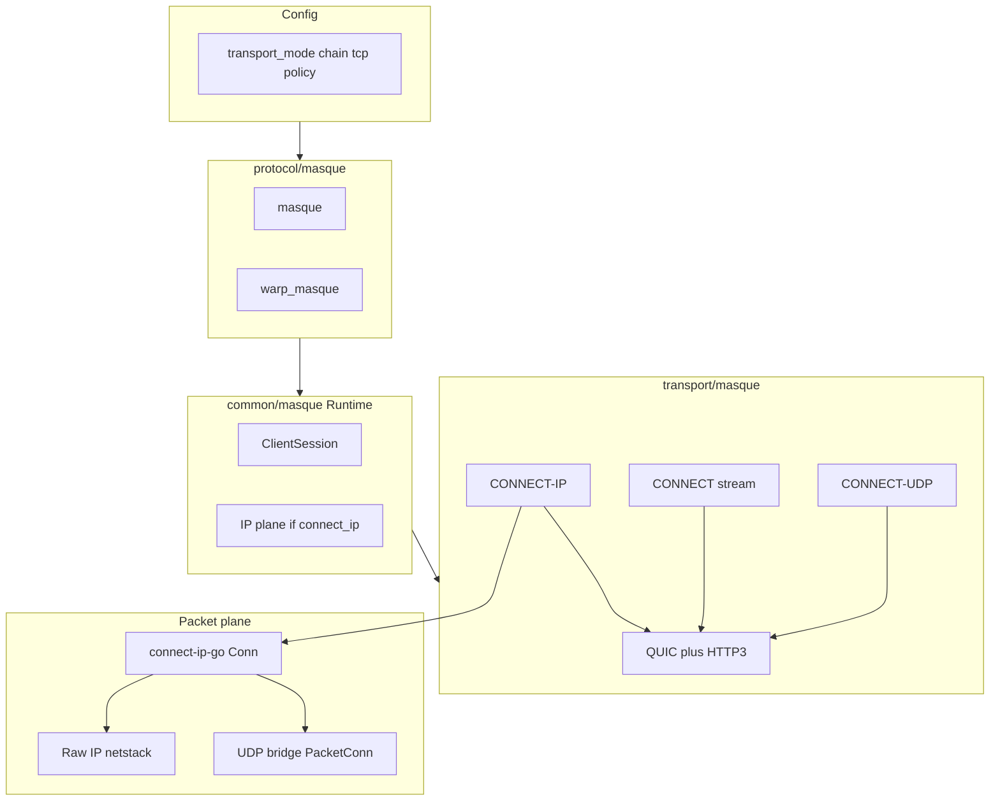

# Идеальная архитектура MASQUE

Норматив для практической реализации dataplane в этом репозитории: **слои, контракты и логика**. Это не замена RFC и не пересказ спецификаций — см. RFC 9298 (MASQUE), RFC 9297 (HTTP Datagrams), RFC 9484 (CONNECT-IP).

Подробная топология endpoint’ов, ADR и совместимость с legacy см. [`hiddify-core/docs/masque-warp-architecture.md`](hiddify-core/docs/masque-warp-architecture.md).

**Терминология (важно):** TCP поверх CONNECT-IP в TUN-only — это **`transport_mode = connect_ip`** + **netstack** поверх **`IPPacketSession`** (`OpenIPSession`), а не значение **`tcp_transport = connect_ip`**: последнее в клиентском профиле **отклоняется валидацией** (`protocol/masque/endpoint.go`). Релейный TCP через MASQUE — только **`tcp_transport = connect_stream`** и **`template_tcp`**.

---

## 1. Конфигурация и политика

- **`transport_mode`**: явное объявление семантики — `auto`, `connect_udp`, `connect_ip`. Выбор должен быть предсказуем правилами возможностей сервера и локальной политики (`MasqueFallbackPolicy`), без «тихого» перехода между режимами там, где контракт строгий.
- **TCP-клиент (production):**
  - **`tcp_transport = auto` запрещён** — нужен явный **`connect_stream`** (см. `validateMasqueOptions` в `protocol/masque/endpoint.go`).
  - **`tcp_transport = connect_ip` запрещён** в TUN-only; для TCP через IP-туннель используется netstack-путь при **`transport_mode = connect_ip`**.
- **`MasqueTCPMode` / fallback:** режим **`masque_or_direct`** возможен только вместе с **`fallback_policy = direct_explicit`** (`endpoint.go`).
- **`hop_policy = chain`:** обязательны **`hops`**, у каждого hop — **`server`** и **`server_port`**; **`tag`** без дубликатов; граф дополнительно проходит через **`CM.BuildChain`** (`common/masque`). Каждый hop не смешивает QUIC-потоки разных расширенных CONNECT.
- **`mtu` (CONNECT-IP ceiling в конфиге):** допустимый диапазон на endpoint — **[1280, 65535]** при ненулевом значении; в transport-слое **`CoreClientFactory.NewSession`** клампит эффективный потолок датаграммы в **[1280, верхний предел]** (`transport/masque/transport.go`). Верхний предел по умолчанию **1500** (interop с типичным QUIC path); для лабораторных jumbo-профилей можно поднять через **`HIDDIFY_MASQUE_DATAGRAM_CEILING_MAX`** (целое, **1280..65535**), иначе игнорируется. Без этого переменная окружения **не** меняет прод-дефолт.
- **Контракт MTU vs payload (не смешивать):**
  - **`tun_mtu`**: локальный MTU TUN-интерфейса в ОС (вплоть до jumbo, напр. 9000) — ответственность платформы/инсталлятора; sing-box не подменяет его «магическим» числом из `mtu` outbound.
  - **`masque_datagram_ceiling`**: верхняя граница размера **полного IP-датаграммы** (IPv4/IPv6), которую мы готовы упаковать в один HTTP/3 QUIC DATAGRAM для CONNECT-IP (после клампа — фактический `datagramCeiling` в `coreSession`). От неё зависят начальный UDP payload ceiling в `connectIPUDPPacketConn` и MTU gVisor NIC в netstack.
  - **`quic_initial_packet_size`**: стартовый размер QUIC-пакета MASQUE-сессии (`transport/masque/transport.go`, `newMasqueQUICConfig`) — отдельный параметр пути; Path MTU discovery для QUIC управляется стеком quic-go и `quic_experimental`.
  - **CONNECT-UDP (родной datagram path):** приложение шлёт **UDP payload**; при необходимости sing-box **нарезает** большие `WriteTo` на несколько QUIC DATAGRAM до `masqueUDPWriteMax` (связано с `datagramCeiling`, см. `masqueUDPDatagramSplitConn` в `transport/masque/transport.go`), чтобы не полагаться на неявное поведение клиента.
  - **Payload на sink (CONNECT-IP):** после декапсуляции IP на серверной границе в UDP-туннель к бэкенду отдаётся **только UDP payload** (`connectIPNetPacketConn` в `protocol/masque/endpoint_server.go`); хэши/байты в тестах считаются по этому слою, а не по raw IP.
- **`fallback_policy` / `tcp_mode`:** жёсткая связка **`masque_or_direct` ↔ `direct_explicit`** задаётся на валидации endpoint; внутри методов **`DialContext`/`ListenPacket`/`OpenIPSession`** в **`coreSession`** эти поля сами по себе режим CONNECT-UDP vs CONNECT-IP **не переключают** — поведение fallback реализуется выше (маршрут/outbound), см. матрицу в `masque-warp-architecture.md`.
- **`fallback_policy = direct_explicit`:** не оправдывает параллельное открытие лишних CONNECT-UDP / CONNECT-IP сессий ради **`ListenPacket`** без явной спецификации.
- **Несовместимые поля клиента:** при **`connect_ip`** не задаётся **`template_udp`**; при **`connect_udp`** — не **`template_ip`** (`endpoint.go`).
- **Экспериментальный QUIC (`quic_experimental.enabled`):** разрешён только при **`MASQUE_EXPERIMENTAL_QUIC=1`** в окружении, иначе fail-fast при валидации (`endpoint.go`) — исключает случайную дрейф‑настройку окон/window sizing в проде.
- Поля **`udp_timeout`** и **`workers`** в конфиге **не поддерживаются** — конфигurator должен их не выдавать (ошибка валидации).
- **Запрет:** скрытые миграции с legacy `warp`/старых путей конфигурации не допускаются (`AGENTS.md` §3).

---

## 2. Слой Endpoint (`protocol/masque`)

- Объект **`adapter.Endpoint`**: lifecycle (стадии старта), экспорт **`DialContext`**, **`ListenPacket`**, при необходимости делегирование расширенному packet-plane через общий runtime.
- **`masque`** (generic): только универсальный MASQUE-клиент/сервер без Cloudflare-специфических URI, заголовков и профилей.
- **`warp_masque`**: изоляция consumer/zero-trust и шаблонов совместимости на этом типе endpoint; общий код — в transport/runtime, но CF-особенности не протекают в generic `masque` (детали путей — `endpoint_warp_masque`, `warp_control_adapter` в `masque-warp-architecture.md`). По правилу паритета с legacy **`warp`**, **embedded registration** (профиль / create / refresh) остаётся в пути endpoint, а не «снаружи» панели (`masque-warp-architecture.md`).
- **Граница зависимостей:** модуль **`common/masque`** не тянет внутренности sing-box **router** — только абстракции factory/runtime; это уменьшает циклы и фиксирует «ядро» MASQUE отдельно от маршрутизации (см. также `masque-warp-architecture.md`).

---

## 3. Слой Runtime (`common/masque`)

- Единая точка входа **`Runtime`**: **`Start`** поднимает сессию к серверу, **`DialContext`** / **`ListenPacket`** работают только при **`Ready`**.
- **Наблюдаемость состояния:** помимо **`IsReady()`** контракт расширен **`LifecycleState() State`** и **`LastError() error`**: **`IsReady()` ⇔ `LifecycleState()==Ready`**; при **`Degraded`/`Connecting`/`Reconnecting`** последняя ошибка старта/сессии доступна через **`LastError`** и **приклеивается** к сообщению «runtime is not ready» через **`errors.Join`** (без скрытия первопричины). Для **`Closed`** dial/listen возвращают явное **`runtime is closed`**.
- **Переподключение:** до **3 попыток** `NewSession` с коротким backoff; состояния **`Init` → `Connecting` → `Ready` / `Degraded` / `Reconnecting` → `Closed`**; при старте новой сессии старая сессия и **`ipPlane`** сбрасываются согласованно (`runtime.go`).
- При **`transport_mode == connect_ip`**: при **`Start`** один раз вызывается **`session.OpenIPSession`**, результат кэшируется в **`ipPlane`**; внешний **`OpenIPSession`** при готовности отдаёт тот же объект. На уровне **`coreSession`** повторные открытия IP-сессии переиспользуют общий **`connectip.Conn`** (`openIPSessionLocked` в `transport/masque/transport.go`).
- **Владение CONNECT-IP:** закрытие обёртки **`connectIPPacketSession`** **не** разрывает общий **`connectip.Conn`** — teardown только у **`coreSession`** (`connectIPPacketSession.Close` возвращает `nil` умышленно), иначе гонки с packet-plane netstack.

---

## 4. Слой Transport (`transport/masque`)

Ответственность: QUIC dial (в т.ч. экспериментальные окна / **`MaxDatagramFrameSize`** — только через флаг экспериментального QUIC выше), HTTP/3, расширенные CONNECT по URI templates.

**Фабрика сессии в коде:** конкретные типы — **`CoreClientFactory`** (QUIC/MASQUE core) и **`DirectClientFactory`** (прямой TCP/локальный UDP без MASQUE), оба в [`transport/masque/transport.go`](hiddify-core/hiddify-sing-box/transport/masque/transport.go); runtime endpoint’ов должен использовать только эту пару стратегий без legacy alias-слоя.

**`ListenPacket` и режим транспорта:** ветка CONNECT-IP (**`openIPSessionLocked` + `connectIPUDPPacketConn`**) выбирается только при **`transport_mode == connect_ip`** (точное строковое совпадение в `coreSession.ListenPacket`); при **`auto`** / **`connect_udp`** используется CONNECT-UDP через **`qmasque.Client`** и **`template_udp`** — не смешивать с IP plane.

**`DialContext` и TCP:** при **`tcp_transport == connect_stream`** TCP идёт в **`dialTCPStream`** (расширенный CONNECT/stream). Если бы **`tcp_transport == connect_ip`** дошёл до core (не должно после валидации клиента), **`DialContext`** возвращает ошибку «TUN packet-plane only» — защита в глубине (`coreSession.DialContext` в `transport/masque/transport.go`).

Три **несмешиваемые** семантики данных:

| Механизм | Носитель данных | Контракт приложения |
|----------|------------------|---------------------|
| CONNECT-UDP | HTTP Datagram (+ привязка к ресурсу UDP) | `ListenPacket` / отправка UDP payload к удалённому сокету по шаблону |
| CONNECT stream | один или несколько потоков byte-oriented | `DialContext` TCP-подобная семантика по stream (`template_tcp`) |
| CONNECT-IP | HTTP Datagram (**Context ID = 0** ⇒ полный IP-пакет) + capsule protocol на управляющем потоке | **`ReadPacket`/`WritePacket` на границе IP** |

- **Капсулы** (ADDRESS_ASSIGN, ROUTE_ADVERTISEMENT и др.): должны быть согласованы с проверками на приёмной стороне `connect-ip` (источник/назначение/протокол в допустимых префиксах и маршрутах). Несогласованность ⇒ отброс пакета или fail-fast по политике, а не беззвучная деградация bulk.
- **Потолок записи:** если **`len(buffer) > datagramCeiling`**, отказ **до** вызова **`connectip.Conn.WritePacket`** с классификацией **`ceiling_reject`** / событием **`packet_write_fail_ceiling`** (`connectIPPacketSession.WritePacket`).

Граница с нижним уровнем: пакет **`third_party/connect-ip-go`** (**`Conn`**): приём/отправка датаграмм, декремент TTL/Hop Limit в **`composeDatagram`**, при **`SendDatagram` → `DatagramTooLarge`** — генерация ICMP PTB и возврат сырого ICMP-пакета вызывающему коду для инъекции в стек.

---

## 5. Packet plane (CONNECT-IP)

- **Один акт декремента TTL (IPv4) / Hop Limit (IPv6)** на границе записи в туннель — в **`composeDatagram`** (`connect-ip-go`). Повторная отправка **того же** слайса без копии снова уменьшит TTL; норма для вызывающего кода выше **`Conn`** (например **`netstack_adapter.writePacketWithRetry`**) — **копия буфера на каждую попытку**.
- **MTU / NIC / QUIC:** MTU netstack в **`connectIPTCPNetstackFactory`** согласуется с **`datagramCeiling`** (в т.ч. ветки **<1280** и **>1500** для gVisor NIC). Это отдельный кламп от endpoint **`mtu`** и от transport **`[1200,1500]`** — все три уровня должны учитываться при отладке bulk.
- Цикл **PTB:** слишком большой QUIC DATAGRAM ⇒ PTB ⇒ уменьшение effective UDP payload в UDP-мосте; сырой IP-путь должен либо получать PTB через обратную инъекцию в netstack (**`WriteNotify`**), либо не превышать согласованный размер кадра.
- Два допустимых **пути использования одной CONNECT-IP сессии** (разный контракт):
  - **Сырой IP:** пакеты от gVisor ⇒ **`WritePacket`/`ReadPacket`** без пересборки L4 (`transport/masque/netstack_adapter.go`).
  - **UDP-мост:** семантика `PacketConn` ⇒ IPv4/UDP оболочка (**`connectIPUDPPacketConn`**), фрагментация приложенческого UDP по effective payload и PMTU state.
- **Текущее ограничение этапа:** `connectIPUDPPacketConn` в product-коде остается IPv4-only для UDP bridge (IPv6 UDP bridge пока не включен в контракт и CI как PASS-path).

Обе ветви используют одну **`IPPacketSession`**, но не подменяют друг друга контрактом.

---

## 6. Потребители dataplane и серверный путь

- **Клиент:** трафик с TUN/маршрутизатора доходит до stream/UDP/connect-ip путей по правилам sing-box без скрытых обходов policy.
- **Сервер CONNECT-IP** (`protocol/masque/endpoint_server.go`): после прокси потока — **`AssignAddresses`**, затем **`AdvertiseRoute`** (с таймаутом контекста), затем обёртка **`connectIPNetPacketConn`** и **`RoutePacketConnectionEx`** (через **`routePacketConnectionExBypassTunnelWrapper`**). Отдельный TCP-мост для CONNECT-IP на сервере — **антипаттерн** относительно TUN-only контракта (в коде зафиксировано переключение на единый packet path).
- **Граница server packet-adapter:** для UDP трафика `connectIPNetPacketConn` должен отдавать в `RoutePacketConnectionEx` именно UDP payload (а не IPv4/IPv6+UDP header blob), иначе в bulk-check появляется ложный hash/loss дрейф при корректной CONNECT-IP сессии.
- **Ретрансляция ICMP на сервере:** при цикле «запись + ICMP feedback» действует **верхняя граница итераций** (**`connectIPMaxICMPRelay`**, сейчас 8) в **`connectIPNetPacketConn.writeOutgoingWithICMPRelay`** — защита от бесконечного PTB-loop.
- **Серверный TCP CONNECT (stream):** отдельные HTTP/3 handlers, политики **`allow_private_targets`**, порты, **`server_token`** — не смешивать с CONNECT-IP packet path (матрица в `masque-warp-architecture.md`).
- Изоляция **warp_masque** consumer: generic серверный masque не обязан знать WARP-детали.

---

## 7. Наблюдаемость и классификация ошибок

Сообщать и считать по классам: **policy**, **capability**, **transport**, **dial**, **lifecycle**.

Для CONNECT-IP: **`connect_ip_*_total`** (tx/rx байты и пакеты, выходы чтения, отказы записи, PTB, сбросы сессии, netstack dequeue/inject/drop, PMTU updates), ключ **`connect_ip_bypass_listenpacket_total`** в снимке API (резерв/расширяемость; инкрементация в коде может отсутствовать до включения bypass-пути), плюс map по причинам — для bulk без ослабления таймаутов e2e.

**Perf / CI:** канонический контракт артефактов и порогов — [`hiddify-core/docs/masque-perf-gates.md`](hiddify-core/docs/masque-perf-gates.md): строго **`result: true|false`**, ключи **`test_id`**, **`mode`**, **`metrics`**, **`thresholds`**, **`error_class`**; smoke track допускает **`go test`** по путям `./protocol/masque ./transport/masque ./common/masque ./include -tags with_masque`, race по **`protocol/masque`** и **`transport/masque`**, и unified runner **`python experiments/router/stand/l3router/masque_stand_runner.py --scenario tcp_ip`** (наряду с операторским Python из `AGENTS.md`§5 — разные входы под PR vs локальную отладку, см. ниже §8).

---

## 8. Верификация

- **Основной операторский e2e:** **`experiments/router/stand/l3router/masque_stand_runner.py`** (сценарии `udp`, `tcp_stream`, `tcp_ip`, `all` — `AGENTS.md` §5).
- **Perf-канон текущего этапа:** основная оценка потолка делается через `tcp_ip_iperf` (`--scenario real`) при MTU 1500 и sweep по rate без искусственного shaping; `bulk_single_flow` оставлять только как контрактный integrity-check (hash/settle), а не как источник truth по производительности.
- **Perf-gates / PR CI (документировано):** stand runner Python entrypoint (`masque_stand_runner.py`) + артефакты вида **`runtime/smoke_*_latest.json`**, **`runtime/*_perf_500mb_*.json`** под деревом стенда (имена перечислены в **`masque-perf-gates.md`**); workflow **`masque-gates`** / nightly **`masque-nightly-perf`** в **`hiddify-core/.github/workflows/ci.yml`**. Shell wrappers допустимы как локальная обвязка только если реально присутствуют в репозитории.
- **CONNECT-IP closure (минимальный чеклист приёмки, из `masque-connect-ip-staged-closure.md`):** lifecycle teardown без гонок при ретраях/close; интеграционные кейсы dial/read/write/close, ретрай по временным ошибкам, fail-closed при **`strict_masque`**; в стабильных успешных прогонах **не** считать нормой типизированный **`ErrTCPStackInit`** при default factory.
- Противоречие формулировок: файл **`masque-connect-ip-staged-closure.md`** исторически говорит «`tcp_transport=connect_ip` enabled» — **канон для IDEAL и кода** остаётся отказ **`tcp_transport=connect_ip`** на клиенте и TCP через **netstack + `transport_mode=connect_ip`** (`endpoint.go`); при правках staged-closure лучше выровнять текст к этой модели.
- После изменений dataplane: **unit/race** по затронутым пакетам + повтор релевантных сценариев из **`AGENTS.md`**.

---

## 9. Соответствие стандартам (сжатая карта)

| Документ | Роль для реализации |
|----------|----------------------|
| **RFC 9298** | Каркас MASQUE: HTTP/3 + расширенный CONNECT для UDP прокси, IP-прокси (CONNECT-IP), «stream» TCP; **URI Template** ([RFC 6570](https://www.rfc-editor.org/rfc/rfc6570)) для построения целевых URL — отсюда требования к **`template_*`** в конфиге. |
| **RFC 9297** | HTTP Datagrams: в HTTP/3 полезная нагрузка QUIC DATAGRAM — **Quarter Stream ID (varint) + HTTP Datagram Payload**; переговоры **`SETTINGS_H3_DATAGRAM = 1`** (IANA `0x33`) **до** отправки датаграмм; при HTTP/1.1/2 — тот же смысл через капсулу **`DATAGRAM`**. Неизвестный **тип капсулы** на конечной точке — **молча отбросить** и продолжить разбор (не рвать поток). Семантика **Context ID** для CONNECT-UDP/IP задаётся в **9298/9484** в составе payload, а не отдельным «register format» в тексте 9297. |
| **RFC 9484** | CONNECT-IP: капсулы назначения адресов и маршрутов; **Context ID 0** — полный IP-пакет; **ненулевой ID** — расширения; при неизвестном ID — **silent drop** или **краткая буферизация** (~один RTT) до возможной регистрации контекста. **ICMP** при ошибках форвардинга — **SHOULD** в туннеле. Для IPv6 фильтра по протоколу — **обход цепочки extension headers** (**§4.8**); в **`connect-ip-go`** (апстрим и vendored) помечено **TODO** — общий разрыв «идеал ↔ код». |
| **RFC 9308** (справочно) | Применимость транспорта QUIC: оговорки для протоколов поверх QUIC (ненадёжность датаграмм, настройка таймеров и т.д.) — ориентир для ожиданий по bulk и повторным попыткам, не замена наших perf-gates. |
| **IANA** | [MASQUE URI suffixes](https://www.iana.org/assignments/masque/masque.xhtml): сегменты **`udp`** (9298), **`ip`** (9484) под **`.well-known/masque/...`**. |

**Расширенный CONNECT (обобщённо 9298 / 9484):** **`:method` CONNECT**, **`:protocol`** **`connect-udp`** или **`connect-ip`**, непустые **`:authority`**, **`:scheme`**, **`:path`** (из URI Template); признак **`Capsule-Protocol: ?1`**; успех — **101 Upgrade** (HTTP/1.1) или **2xx** (HTTP/2/3). **CONNECT-UDP:** переменные шаблона **`target_host`**, **`target_port`**. **Капсулы ADDRESS_ASSIGN / ROUTE_ADVERTISEMENT:** каждая новая капсула задаёт **полный** актуальный набор (замена предыдущего объявления); нарушение порядка в ROUTE_ADVERTISEMENT — **abort** потока по спецификации.

На стороне клиента HTTP/3 **нельзя полагаться на отправку QUIC DATAGRAM** до взаимного **`SETTINGS_H3_DATAGRAM = 1`**; иначе нарушение спецификации и риск **`H3_DATAGRAM_ERROR`**. Идеальный контур в нашем стеке — не слать CONNECT-IP payload «вслепую» сразу после handshake, пока transport не гарантирует готовность датаграмм для запроса.

**Эталонные реализации (внешние):**

- **[`quic-go/connect-ip-go`](https://github.com/quic-go/connect-ip-go)** — эталон CONNECT-IP (RFC 9484) на **quic-go**/**http3**: **`ReadPacket`** / **`WritePacket`**, **`composeDatagram`** (TTL, checksum), **ICMP PTB** при **`DatagramTooLarge`**, политика **`handleIncomingProxiedPacket`**, капсулы адресов/маршрутов; **`masque-go`** — отдельно **CONNECT-UDP (RFC 9298)**. Наш **`third_party/connect-ip-go`** наследует эту линию; при расхождениях с RFC сначала сверять **апстрим** и форки (**MetaCubeX/connect-ip-go**).
- **Типичные ограничения эталона (и нашего форка):** **TODO ICMP** при отказе по src/dst; **TODO IPv6 extensions**; **ADDRESS_REQUEST** у пира часто «not supported» — интроперировать только с совместимыми пирами.

**Mihomo (MetaCubeX) — где полезно, где нет:**

- **Полезно:** прикладная модель клиентского **MASQUE / CONNECT-IP** (Wiki: транспорт **QUIC по умолчанию**, опция **`network: h2`**, **`mtu`** по умолчанию около **1280**, **`udp`** как UDP внутри IP-туннеля, **`congestion-controller`/`bbr`**) — ориентиры для QUIC tuning и пользовательских ожиданий; зависимость **`metacubex/connect-ip-go`** — независимый источник фиксов рядом с **quic-go**.
- **Слабо переносимо:** Mihomo — ядро Clash (**не** форк sing-box): нет прямого соответствия **`protocol/masque`/`transport/masque`** sing-box; **отдельного CONNECT-UDP outbound** как у нас с **`template_udp`** в публичной доке почти не видно; **MASQUE-сервер** и e2e-стенд sing-box через Mihomo не нормируются.

**Расхождения, которые код компенсировать документацией и тестами (не игнорировать):**

| Тема | RFC / эталон | Практика в связке vendored **`connect-ip-go`** + обвязка |
|------|----------------|----------------------------|
| Неизвестный **тип капсулы** | Принимающая сторона **MUST** молча пропускать (9297) | Разбор потока может завершаться ошибкой **`unknown capsule type`** — риск несовместимости при расширении капсул у пира; усиливать тестами interop и поэтапно согласовать с апстримом. |
| **Context ID ≠ 0** | Silent drop или краткая буферизация (9484) | Цикл **drop + retry read** без буфера — допустимый минимум; при появлении контекстов выше IP — понадобится явная политика. |
| ICMP при политике | SHOULD сигнализировать ошибки форвардинга (9484) | **TODO: send ICMP** в части веток — наблюдаемость и PTB должны покрывать пользовательские сценарии на нашей стороне. |

**Типичные ошибки против спеки (чеклист ревью):**

1. QUIC DATAGRAM до завершённого обмена **SETTINGS_H3_DATAGRAM**.  
2. «Дожимание» oversize PDU переводом QUIC DATAGRAM ↔ capsule **без потери семантики** PMTUD (обход QUIC MTU нежелателен).  
3. Закрытие потока из‑за **неизвестной капсулы** там, где требуется **silent skip**.  
4. CONNECT-UDP: выходящий UDP **> 65527** байт полезной нагрузки в некоторых профилях — **abort** по 9298.  
5. Неверный Extended CONNECT (**пустые** псевдозаголовки, неверный **`:protocol`**) или трактовка редиректа как успеха туннеля.

**Устойчивые паттерны реализации (норматив, в том числе с эталоном quic-go):**

- Один декремент TTL/Hop Limit на инкапсуляцию в HTTP Datagram для пересылки; **TTL ≤ 1** / **Hop Limit ≤ 1** — не отправлять (как в эталонном **`composeDatagram`**).
- **PTB**: при **`DatagramTooLarge`** — вернуть **ICMP** вызывающему коду для инъекции в стек (**caller** отправляет ICMP обратно отправителю IP).
- Явный потолок размера IP в DATAGRAM + **не** подменять «сломленный» PMTU молчаливым drop без сигнала.
- Согласованность **address/route capsules** ↔ ingress filter (**ICMP к dst** в маршрутизации часто разрешён отдельно от `IPProto`).
- **Неизвестный Context ID**: как минимум silent drop **с метрикой**; при межоперабельности с расширяющимися пирами — рассмотреть краткий буфер по 9484.
- Копия буфера IP перед повторным **`WritePacket`**, если уровень ниже мутирует заголовок.
- Не ослаблять fail-closed и таймауты ради «зелёного» отчёта (`AGENTS.md` §3).

---

## 10. Антипаттерны (явно)

- Ослабление проверок e2e / раздувание таймаутов только ради PASS.
- Скрытые миграции пользователей с legacy **`warp`** на новые endpoint’ы без явного конфига.
- Смешение QUIC-потоков / сессий между hop’ами chain или между CONNECT-UDP и CONNECT-IP «для упрощения».
- TCP-мост на сервере рядом с packet-plane CONNECT-IP для того же класса трафика.
- Прятать Cloudflare-специфику в generic **`masque`**.
- Игнорировать **`ErrTCPStackInit`** / гонки close в стабильных прогонах CONNECT-IP (см. `masque-connect-ip-staged-closure.md`).

---

## Схема слоёв (упрощённо)

