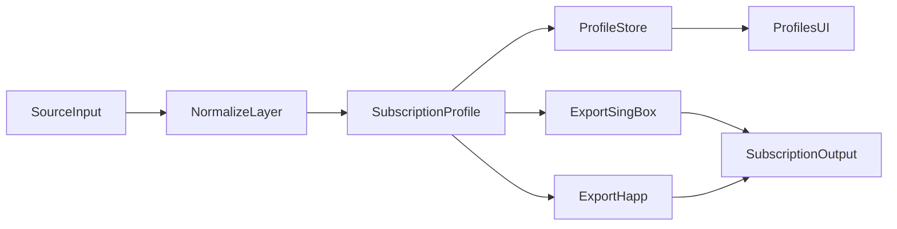
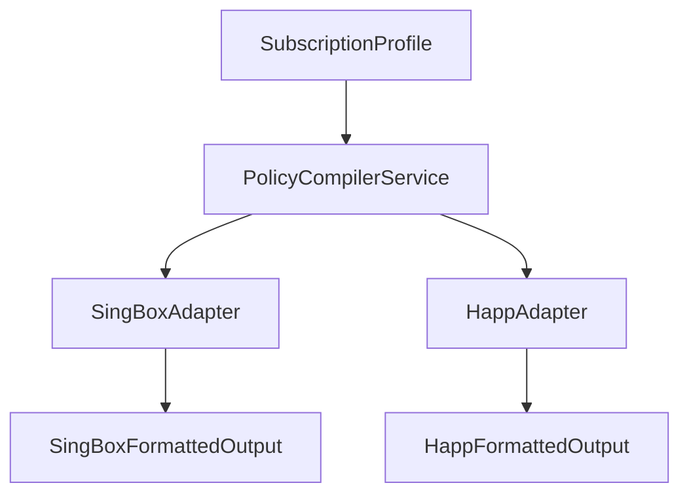

# Unified Subscription Architecture: sing-box + Happ

## Scope and goal

Design a single UI and backend architecture where:

- one row in UI table = one subscription profile;
- profile model is shared for all providers;
- export/serve layer adapts output to target client format (`sing-box` or `Happ`);
- routing (`direct/proxy/block`) and DNS behavior are explicit, versioned, and testable.

This document is implementation-oriented and based on current public documentation/release baselines.

## Version baseline (current)

### sing-box baseline

- Stable line: `v1.13.x` (latest observed: `v1.13.11`, published `2026-04-23`).
- Preview line: `v1.14.0-alpha.x` (latest observed: `v1.14.0-alpha.17`, published `2026-04-23`).
- Routing/rule-set design must be compatible with `v1.13` and forward-safe for `v1.14`.

### Happ baseline

- Desktop latest observed: `2.9.0` (published `2026-04-17`).
- Android latest observed: `3.18.1` (published `2026-04-17`).
- Routing profile docs and examples on `happ.su` are treated as canonical behavior contract.

## Core idea

Use a provider-neutral domain object `SubscriptionProfile` as source of truth, then map:

- `SubscriptionProfile -> sing-box payload` (URI list/JSON, plus optional metadata headers),
- `SubscriptionProfile -> Happ payload` (servers + `happ://routing/...` link or `routing` header).



## UI architecture: one row = one profile

## Profiles page

Table columns (minimal):

| Column | Meaning | Notes |
|---|---|---|
| `Name` | Profile display name | User override > provider title > URL-derived fallback |
| `Type` | `sing-box` / `happ` / `mixed` | Determines export adapter |
| `Source` | URL / local / generated | Includes provider marker |
| `Routing` | Policy status | `off`, `simple`, `advanced`, `legacy` |
| `DNS` | Policy status | `system`, `remote`, `split`, `custom` |
| `Update` | Auto update interval + last sync | Human readable + icon state |
| `Health` | Parse/apply status | ok/warn/error with tooltip |
| `Usage` | upload/download/total/expire (if present) | Subscription metadata |
| `Actions` | Apply, Edit, Refresh, Export, Disable | Single-row actions |

Bulk actions:

- enable/disable auto-update,
- force refresh,
- apply routing policy template,
- export selected profiles in target format.

## Profile details panel

Sections:

1. **Identity**: name, tags, source URL, target client type.
2. **Update policy**: enabled, interval, last success/error, retry policy.
3. **Routing policy**:
   - order (`block/proxy/direct` permutations),
   - direct/proxy/block lists (site/ip),
   - geo assets references/version.
4. **DNS policy**:
   - remote/domestic server and type,
   - hosts map,
   - fake DNS options.
5. **Compatibility**:
   - key naming mode (`canonical`, `legacy-accept`),
   - fallback behavior preview.
6. **Preview**:
   - generated output for `sing-box`,
   - generated output for `Happ`.

## Backend architecture

## Domain model (`SubscriptionProfile`)

```text
SubscriptionProfile
  id
  name
  providerType            // singbox | happ | mixed
  source                  // remote | local | generated
  sourceUrl
  updatePolicy
    enabled
    interval
    timeout
    retryPolicy
  metadata
    title
    supportUrl
    webPageUrl
    usageInfo(upload/download/total/expire)
  routingPolicy
    enabled
    routeOrder            // ordered list of actions
    directSites[]
    directIp[]
    proxySites[]
    proxyIp[]
    blockSites[]
    blockIp[]
    geoSources
  dnsPolicy
    remote(type/domain/ip)
    domestic(type/domain/ip)
    hosts{}
    fakeDnsEnabled
    domainStrategy
  compatibility
    keyNamingMode
    allowLegacyKeys
    allowStringBooleans
  state
    lastApplyStatus
    lastError
    checksum
```

## Service boundaries

- `ProfileIngestService`: fetch, parse headers/body, normalize.
- `ProfileStoreService`: persist profile and state.
- `PolicyCompilerService`: compile routing/dns policy to canonical internal representation.
- `AdapterService`:
  - `SingBoxAdapter`,
  - `HappAdapter`.
- `ValidationService`: schema and semantic checks per target.
- `DeliveryService`: produce HTTP body/headers for subscribers.

## Target adapters



## Mapping tables

## Geo tags and matcher compatibility

### Verified data baseline from Loyalsoldier DAT files

Validation was performed against the latest release assets:

- `geoip.dat`: `19,529,867` bytes;
- `geosite.dat`: `10,659,453` bytes.

Binary protobuf decoding confirms:

- `geoip` tag count: `260`;
- `geosite` tag count: `1464`.

Observed samples:

- `geoip`: `ad`, `ae`, `af`, `ag`, `al`, `am`, ... (country-oriented codes);
- `geosite`: `alibaba`, `alibabacloud`, `aliyun`, `aliyun-drive`, ... (domain/category-oriented tags).

This matches Happ UX behavior where users manually assemble policy lists from geo tags.

### Practical tag model in UI

Expose tags as first-class routing tokens in UI, with strict canonical form:

- `geosite:<tag>`
- `geoip:<tag>`

Examples supported in editor:

- `geosite:alibaba`
- `geosite:alibabacloud`
- `geosite:aliyun`
- `geosite:aliyun-drive`
- `geoip:ag`
- `geoip:al`
- `geoip:am`

### Canonicalization rules (required)

At ingest and save time:

1. trim spaces;
2. normalize prefix to lowercase (`geosite:`, `geoip:`);
3. normalize tag body to lowercase;
4. reject empty tag body;
5. deduplicate per list preserving first occurrence order.

This avoids provider-specific case drift (`ALIBABA` vs `alibaba`) and keeps deterministic exports.

### Tag catalog ingestion pipeline (required)

To support Happ-like profile editing in `s-ui`, keep a normalized local catalog generated from `geoip.dat/geosite.dat`:

1. fetch release assets on schedule;
2. decode protobuf entries (`GeoIPList`/`GeoSiteList`);
3. normalize tokens to canonical form;
4. persist compact catalog with metadata (source version/hash/counts);
5. expose catalog API for UI autocomplete/filter/grouping.

Recommended catalog record shape:

```text
GeoCatalogEntry
  kind                // geoip | geosite
  tagRaw
  tagNorm             // lowercase
  token               // geoip:<tagNorm> or geosite:<tagNorm>
  itemCount           // CIDR/domain count
  attributes[]        // geosite attrs when present
  sourceVersion
  sourceSha256
  updatedAt
```

### Validation and fallback contract for geo tokens

At profile save and at compile time:

- format-check token syntax;
- existence-check against current catalog;
- classify status as `valid`, `unknown`, or `invalid`.

Behavior:

- `invalid`: block save with actionable error;
- `unknown`: allow save with warning badge in UI;
- compile step skips unresolved token with warning in health/report output;
- do not silently remap token across namespaces (`geoip:*` is never `geosite:*`).

This keeps editing resilient when catalog versions drift.

## Routing mapping (unified -> Happ)

| Unified field | Happ profile key | Notes |
|---|---|---|
| `routingPolicy.directSites[]` | `DirectSites` | Accept both canonical and legacy naming on ingest |
| `routingPolicy.directIp[]` | `DirectIp` | Supports CIDR/geo tags |
| `routingPolicy.proxySites[]` | `ProxySites` | |
| `routingPolicy.proxyIp[]` | `ProxyIp` | |
| `routingPolicy.blockSites[]` | `BlockSites` | |
| `routingPolicy.blockIp[]` | `BlockIp` | |
| `routingPolicy.routeOrder[]` | `RouteOrder` | Must preserve order semantics |
| `routingPolicy.enabled=false` | `happ://routing/off` | Delivery-level command |

Happ implementation note:

- profile lists accept geo tokens (`geosite:*`, `geoip:*`) as routing matchers;
- docs/examples frequently show lowercase tags; canonical export should keep lowercase;
- JSON subscriptions in Happ may apply their own routing rules, while routing profile supplies geo/DNS context.

## DNS mapping (unified -> Happ)

| Unified field | Happ key |
|---|---|
| `dnsPolicy.remote.type` | `RemoteDNSType` |
| `dnsPolicy.remote.domain` | `RemoteDNSDomain` |
| `dnsPolicy.remote.ip` | `RemoteDNSIP` |
| `dnsPolicy.domestic.type` | `DomesticDNSType` |
| `dnsPolicy.domestic.domain` | `DomesticDNSDomain` |
| `dnsPolicy.domestic.ip` | `DomesticDNSIP` |
| `dnsPolicy.hosts` | `DnsHosts` |
| `dnsPolicy.fakeDnsEnabled` | `FakeDNS` |
| `dnsPolicy.domainStrategy` | `DomainStrategy` |

## Routing mapping (unified -> sing-box)

| Unified field | sing-box representation | Notes |
|---|---|---|
| `directSites[]` | route rule set + `action=route` -> direct outbound | for `geosite:*` prefer `rule_set` tag mapping |
| `directIp[]` | route rules with ip match -> direct outbound | |
| `proxySites[]` | route rules -> proxy/select outbound | for `geosite:*` prefer `rule_set` tag mapping |
| `proxyIp[]` | route rules -> proxy/select outbound | |
| `blockSites[]` | route rules -> reject/block outbound | |
| `blockIp[]` | route rules -> reject/block outbound | |
| `routeOrder[]` | explicit rule ordering in `route.rules` | critical for deterministic behavior |

sing-box implementation note:

- for modern baselines use `rule_set` + `route.rules` actions;
- avoid relying on deprecated/removed legacy `geosite/geoip` route fields in new design.

## Geo matcher adapter matrix

| Canonical token | Happ export | sing-box export |
|---|---|---|
| `geosite:<tag>` | keep as token inside `*Sites` lists | map to `rule_set` references (preferred), or domain matcher fallback |
| `geoip:<tag>` | keep as token inside `*Ip` lists | map to `rule_set` references (preferred), or ip-cidr matcher fallback where possible |
| `CIDR` | keep in `*Ip` lists | `ip_cidr` match |
| `full:<domain>` | keep as site token if supported by provider policy | `domain`/`domain_suffix`/`domain_keyword` based on parser rules |

## s-ui page architecture (Happ-style profiles)

Goal: implement a dedicated `s-ui` page that follows existing panel patterns while exposing Happ-like profile building:

- one profile row;
- three subprofiles: `direct`, `proxy`, `block`;
- each subprofile edits `Sites` and `IP` lists with geo token pickers.

### Frontend page pattern (aligned with current s-ui)

Recommended structure:

- new view page with table + actions row (`Add`, `Edit`, `Delete`, `Validate`, `Preview`);
- modal editor with tabs:
  - `Identity`,
  - `Routing`,
  - `DNS`,
  - `Compatibility`,
  - `Preview`;
- token editors use searchable multi-select chips with grouped suggestions:
  - `Countries` (from `geoip:*`),
  - `Site categories` (from `geosite:*`),
  - `Recent/Custom`.

Use existing s-ui conventions:

- route registration through frontend router and drawer menu entry;
- CRUD through common store/action flow (`api/save` object/action/data);
- confirmation overlays for destructive actions;
- notivue notifications and i18n keys for all new labels.

### Backend/page contract for s-ui

Implement a dedicated entity and API object (for example `routing_profiles`) with:

- profile metadata;
- normalized direct/proxy/block lists;
- route order;
- dns policy;
- compatibility flags;
- catalog version used during validation.

Compilation targets:

- `Happ`: export profile keys and `happ://routing/...` commands;
- `sing-box`: compile to deterministic `route.rules` + `rule_set` references (no legacy geo fields).

### UX behavior expected by Happ-like flow

- editing always works against catalog tokens, but custom tokens are still allowed with warning state;
- profile preview shows both adapter outputs (`Happ` and `sing-box`) from same source model;
- health column highlights unresolved tokens and adapter-specific drops before delivery.

## Full geo database reuse architecture (UI + backend)

Goal: reuse `geoip.dat` and `geosite.dat` as first-class managed datasets in `s-ui`, not only as static autocomplete sources.

### Data ownership model

Treat geo datasets as managed resources with explicit lifecycle:

- upstream snapshot (read-only baseline from Loyalsoldier);
- local editable overlay (custom tags/items, patches, deletes);
- effective catalog (baseline + overlay merge result), used by profile editors and compilers.

This enables safe updates from upstream while preserving local edits.

### Backend entities (recommended)

```text
GeoDataset
  id
  kind                    // geoip | geosite
  sourceType              // upstream | local
  sourceUrl
  sourceVersion
  sourceSha256
  itemCount
  status                  // ready | updating | error
  updatedAt

GeoTag
  id
  datasetKind             // geoip | geosite
  tagNorm                 // unique per kind
  tagRaw
  origin                  // upstream | local | merged
  metadataJson
  updatedAt

GeoTagItem
  id
  geoTagId
  itemType                // cidr | domain_full | domain_suffix | domain_keyword | domain_regex
  value
  attributesJson
  origin                  // upstream | local
  isDeleted               // tombstone for overlay deletes
```

Optional service table:

```text
GeoCatalogRevision
  id
  datasetKind
  revisionNo
  builtFromVersion
  builtFromSha256
  builtAt
  notes
```

### Mechanism 1: primary initialization

Initialization flow:

1. Download latest `geoip.dat` and `geosite.dat`.
2. Verify checksum and store snapshot metadata.
3. Decode protobuf entries (`GeoIPList`, `GeoSiteList`).
4. Normalize and store tags/items in DB (`GeoTag` + `GeoTagItem`).
5. Build effective catalog revision and mark dataset `ready`.

Init constraints:

- idempotent re-run (same source hash does not duplicate records);
- atomic swap (new revision becomes active only after successful full import);
- import report persisted (added/changed/removed counts).

### Mechanism 2: editing initialized data

Support local editing without mutating upstream snapshot directly:

- add custom tag;
- add/remove/edit items inside tag;
- soft-delete upstream item via overlay tombstone;
- rename local tag (with conflict checks);
- clone upstream tag into local editable variant if needed.

Merge rules for effective catalog:

1. start from upstream items;
2. apply overlay deletes;
3. apply overlay adds/edits;
4. re-normalize and deduplicate;
5. publish new catalog revision.

Validation:

- strict syntax by `itemType`;
- reject cross-kind contamination (`geoip` cannot store domain matchers);
- reject duplicate effective values inside same tag;
- warn when editing tags currently used by active routing profiles.

### Mechanism 3: dedicated concise UI page

Create a separate `s-ui` page `Geo Catalog` following existing concise panel style.

Page layout:

- top toolbar: `Sync`, `Import`, `Create tag`, `Rebuild`, `Validate`, `Diff`;
- compact split view:
  - left: tag list with filters (`kind`, `origin`, `changed`, search);
  - right: selected tag details and item editor table.

Core UX patterns:

- chips and grouped filters for quick navigation;
- inline edit for simple value changes, modal for advanced fields;
- non-destructive delete (confirm + undo window where possible);
- revision badges (`upstream vX`, `local changes`, `needs rebuild`).

### UI integration with routing profile editor

Routing profile page consumes effective catalog only:

- autocomplete queries `GeoCatalog` API;
- unknown token marker shown when profile references missing token;
- quick action from profile editor: `Open in Geo Catalog` for selected token.

This keeps profile editing clean and avoids exposing raw DB complexity there.

### API and service boundaries

Recommended services:

- `GeoDatasetService`: sync/download/import lifecycle;
- `GeoCatalogService`: tag/item CRUD and merge-build;
- `GeoValidationService`: syntax/semantic checks and usage impact checks;
- `GeoUsageService`: reverse index of token usage across profiles.

Suggested API groups:

- `GET /api/geo/catalog` (tag list/search/filter);
- `GET /api/geo/tag/:id` (details with items);
- `POST /api/geo/tag` / `PUT /api/geo/tag/:id` / `DELETE /api/geo/tag/:id`;
- `POST /api/geo/tag/:id/items/bulk`;
- `POST /api/geo/sync`;
- `POST /api/geo/rebuild`;
- `GET /api/geo/revisions` + `POST /api/geo/revisions/:id/activate` (optional).

### Compatibility/export implications

For `Happ` adapter:

- export canonical `geosite:*` and `geoip:*` tokens from effective catalog.

For `sing-box` adapter:

- compile effective catalog references to `rule_set` strategy;
- avoid direct dependency on removed legacy `geosite/geoip` route fields.

### Operational safety

- scheduled sync with configurable cadence and timeout;
- full audit log for geo edits (who, what, before/after);
- rollback to previous catalog revision;
- background rebuild job with status polling in UI.

## Key normalization policy (Happ legacy-safe)

Happ docs and examples use mixed key styles (`PascalCase`, `camelCase`, some legacy variants), so normalization layer must support aliases.

Required alias examples:

- `Geoipurl`, `geoipUrl`, `geoip_url` -> `geo.geoipUrl`
- `Geositeurl`, `geositeUrl`, `geosite_url` -> `geo.geositeUrl`
- `DirectSites`, `directSites` -> `routing.rules.direct.sites`
- `DirectIp`, `directIp` -> `routing.rules.direct.ip`
- `ProxySites`, `proxySites` -> `routing.rules.proxy.sites`
- `ProxyIp`, `proxyIp` -> `routing.rules.proxy.ip`
- `BlockSites`, `blockSites` -> `routing.rules.block.sites`
- `BlockIp`, `blockIp` -> `routing.rules.block.ip`
- `RouteOrder`, `routeOrder` -> `routing.routeOrder`
- `GlobalProxy`, `globalProxy` -> `routing.defaultOutbound`
- `FakeDNS`, `fakeDns`, `fakeDnsEnabled` -> `dns.fakeDnsEnabled`

Boolean values should be accepted as:

- JSON booleans (`true`, `false`)
- numeric booleans (`1`, `0`)
- string booleans (`"true"`, `"false"`, `"1"`, `"0"`).

## DNS mapping (unified -> sing-box)

| Unified field | sing-box representation |
|---|---|
| `dnsPolicy.remote.*` | `dns.servers` primary remote resolver |
| `dnsPolicy.domestic.*` | `dns.servers` direct/domestic resolver + rules |
| `dnsPolicy.hosts` | `dns.hosts` |
| `dnsPolicy.fakeDnsEnabled` | fakeip server + dns rules |
| `dnsPolicy.domainStrategy` | domain strategy fields in dns/route options |

## Delivery formats

## Happ delivery

Supported options:

- body contains `happ://routing/onadd/{base64Json}` + server lines,
- or HTTP header `routing: happ://routing/onadd/{base64Json}`.

Use `happ://routing/off` when profile routing is intentionally disabled.

## sing-box delivery

Support per subscription type:

- URI list (`vless://`, `vmess://`, etc.) for consumer converters,
- JSON array/object when client expects passthrough,
- metadata headers for title/update/userinfo when supported.

## Compatibility and edge cases

## Happ nuances

- Documentation uses mixed naming styles (`PascalCase` examples and `camelCase` text). Ingest must normalize both.
- Legacy keys and string booleans exist in the wild; parser must be tolerant.
- Profile overwrite semantics are name-based in Happ routing links (`add/onadd` behavior).
- For Happ JSON subscriptions, routing rules are taken from JSON subscription itself, while routing profile mainly supplies geo file context and related routing infrastructure behavior.
- Geo tokens should be treated as canonical lowercase in storage and UI, independent of source case.

## sing-box nuances

- `v1.13` vs `v1.14-alpha` differences around route/rule-set/http-client fields.
- Keep canonical internal model stable; adapter decides target-specific field emission.
- Rule action model and rule-set versioning must be explicit in adapter compatibility matrix.
- For geo semantics, prefer `rule_set` strategy over legacy geo fields to keep forward compatibility.

## Validation and acceptance criteria

## Functional checks

1. One profile row can generate both `sing-box` and `Happ` outputs from same domain model.
2. `direct/proxy/block` lists produce deterministic ordering in both adapters.
3. DNS policy maps to both targets without silent drops.
4. Legacy Happ payload variants are accepted and normalized.
5. Version-aware sing-box export works for configured baseline (`1.13` and `1.14-alpha` modes).

## Operational checks

- update loop uses per-profile interval and status transitions,
- invalid payloads surface actionable errors in profile row `Health`,
- export preview equals delivered output checksum.

## Implementation guidance for current repo

Use these existing components as anchor points:

- [lib/features/profile/model/profile_entity.dart](../lib/features/profile/model/profile_entity.dart)
- [lib/features/profile/data/profile_parser.dart](../lib/features/profile/data/profile_parser.dart)
- [lib/features/settings/data/config_option_repository.dart](../lib/features/settings/data/config_option_repository.dart)
- [hiddify-core/v2/profile/profile.proto](../hiddify-core/v2/profile/profile.proto)
- [hiddify-core/v2/config/hiddify_option.go](../hiddify-core/v2/config/hiddify_option.go)
- [hiddify-core/v2/config/builder.go](../hiddify-core/v2/config/builder.go)

## Second-pass verification notes

This document was cross-checked against:

- sing-box official configuration/changelog/release channels,
- Happ official docs for routing/subscription plus desktop/android releases.

Ambiguities (handled by design):

- Happ naming inconsistencies are absorbed by normalization layer.
- sing-box preview/stable deltas are handled by adapter capability flags.

## Reference sources (latest docs/release channels)

- sing-box docs: <https://sing-box.sagernet.org/configuration/>
- sing-box route: <https://sing-box.sagernet.org/configuration/route/>
- sing-box rule action: <https://sing-box.sagernet.org/configuration/route/rule_action/>
- sing-box rule-set: <https://sing-box.sagernet.org/configuration/rule-set/>
- sing-box changelog: <https://sing-box.sagernet.org/changelog/>
- sing-box releases: <https://github.com/SagerNet/sing-box/releases>

- Happ routing docs: <https://www.happ.su/main/dev-docs/routing>
- Happ routing docs (RU, contains JSON-subscription geo/rules caveat): <https://www.happ.su/main/ru/dev-docs/routing>
- Happ examples/docs: <https://www.happ.su/main/dev-docs/examples-of-links-and-parameters>
- Happ subscription FAQ: <https://www.happ.su/main/faq/adding-configuration-subscription>
- Happ desktop releases: <https://github.com/Happ-proxy/happ-desktop/releases>
- Happ android releases: <https://github.com/Happ-proxy/happ-android/releases>
