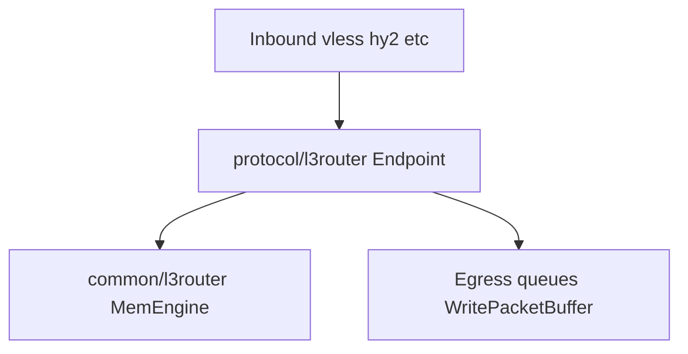

# L3 Router — идеальная архитектура (WG-подобная, Variant B)

## Назначение

`l3router` — серверный L3-роутер в топологии hub-and-spoke, работающий по peer-модели WireGuard (AllowedIPs/LPM/no-loop), но без криптографии в самом роутере.

Крипто-идентификация клиента выполняется транспортным inbound sing-box (`vless`/`hy2`/другие).  
После успешной auth сервер один раз сопоставляет соединение с `PeerID`.  
Дальше dataplane `l3router` работает только с `PeerID` и IP-пакетом.

## Место в дереве sing-box

| Путь | Роль |
|------|------|
| `protocol/l3router/` | Эндпоинт (`TypeL3Router`): регистрация, конфиг, сессии, egress — как `protocol/wireguard`, `protocol/tailscale`. |
| `common/l3router/` | Чистое ядро маршрутизации (`MemEngine`, LPM, ACL): без транспортных типов sing-box. |
| `include/l3router.go` / `l3router_stub.go` | Условная регистрация эндпоинта при сборке с `-tags with_l3router`. |
| `option/l3router_endpoint.go` | JSON-модель опций эндпоинта. |
| `experiments/router/stand/l3router/` | Интеграционный стенд: `python run.py` — сборка, деплой, Docker, SMB 100 MiB. |

## Жесткие архитектурные ограничения

- `l3router` dataplane не знает про user/session другого протокола sing-box.
- В hot path нет `SessionKey`/string identity и user-level map lookup.
- Внешняя packetization-граница sing-box сохраняется (канонический `WritePacketBuffer` путь).
- Базовый режим — static-first конфиг peer-like маршрутов в JSON.
- Legacy/fallback/compatibility режимы не допускаются в целевой архитектуре.

## Модель идентичности (Variant B)

### Кто идентифицирует клиента

Транспортный inbound sing-box подтверждает клиента (протокольная auth/crypto).

### Кто присваивает `PeerID`

`protocol/l3router` на сервере (endpoint adapter) один раз на lifecycle connection:

1. inbound auth success;
2. resolve static route peer;
3. bind `connection -> PeerID`;
4. далее все пакеты передаются в engine с этим `PeerID`.

### Что видит engine

Только:

- `packet []byte`,
- `ingressPeerID`,
- внутренние FIB/ACL структуры.

Никаких ссылок на user/session/vless/hy2 внутри routing core.

## Data Plane (WG-подобный)

1. Принять raw IP пакет + `ingressPeerID`.
2. Быстрый parse (v4/v6, минимум ветвлений).
3. `AllowedSrc`/anti-spoof для ingress peer (если ACL on).
4. `dst` longest-prefix lookup по FIB.
5. Выбор `egressPeerID` с no-loop guard.
6. Передача в egress peer pipeline через протокольный слой sing-box.

## Control Plane (static-first)

- Основной путь: статический JSON (`peers`) как peer-like таблица.
- Runtime route API не обязателен для штатного трафика и остается только ops-инструментом.
- Любая динамика не должна ломать read-mostly dataplane и snapshot semantics.

## Конфигурационная семантика peer-like маршрута

Каждый peer содержит:

- стабильный `peer_id` (логический peer в dataplane),
- `user` (строка = `InboundContext.User` / имя пользователя inbound),
- `allowed_ips` (префиксы в FIB, семантика WireGuard AllowedIPs),
- опционально `filter_source_ips` / `filter_destination_ips` при `packet_filter: true`.

### Инвариант `RouteID` и `PeerID`

В `MemEngine` маршрут индексируется как `PeerID(Route.PeerID)`. Значение **`peer_id` в конфиге должно совпадать** с тем `PeerID`, который endpoint передаёт в `HandleIngressPeer` для сессий этого пира. Иначе FIB и фильтр рассинхронизируются с привязкой сессии.

## Текущее состояние реализации (слои vs wg-go)

| Роль | wg-go | l3router (sing-box) |
|------|-------|----------------------|
| LPM по dst (FIB) | `device/allowedips` radix trie | `common/l3router/allowedips_peer.go` (`allowedIPTable`, тот же класс алгоритма, значение — `PeerID`) |
| Фильтр по src/dst при `packet_filter` | модель пира в `device`, не отдельный общий слой | `common/l3router/prefix_matcher.go` — membership по `FilterSourceIPs` / опционально `FilterDestinationIPs` (не FIB) |
| Разбор IPv4/IPv6 заголовка | внутри `device` | `common/l3router/packet_parse.go` |
| Транспорт и сессии | Noise / peer | `protocol/l3router` (`SessionKey`, очереди, `WritePacketBuffer`) |

Альтернативных FIB-backend’ов в dataplane нет: lookup — `wg_allowedips` только.

## KPI и критерии приемки

- Single-thread plain демонстрирует устойчивый прогресс к wg-like lookup.
- Parallel/fairness не деградирует больше согласованных порогов.
- `drop/op` и `error/op` не растут.
- ACL off остается максимально легким path.
- ACL on остается корректным и предсказуемым по overhead.

## Performance Contract (vs wg-go)

Для CPU-first итераций обязательна проверка относительной дельты к `wg-go`:

- lookup anchor: `BenchmarkMemEngineHandleIngress` (и при необходимости `BenchmarkMemEngineHandleIngressWGAllowedIPs`) vs `BenchmarkAllowedIPsLookupSingleFlowLikeL3Router`,
- plain e2e anchor: `BenchmarkL3RouterEndToEndSyntheticTransport/plain_l3router_baseline` vs `BenchmarkWireGuardAllowedIPsEndToEndSyntheticTransport/plain_l3router_baseline`,
- те же имена под-бенчей для синтетики `vless`/`hy2`/`tuic`/`mieru` на обеих сторонах,
- parallel/fairness: `BenchmarkMemEngineHandleIngressManyFlowsOneOwnerParallel` vs `BenchmarkAllowedIPsLookupManyFlowsOneOwnerParallelLikeL3Router`, плюс e2e parallel с нулевыми `error/op`.

Acceptance-per-iteration:

1. single-thread delta к `wg-go` уменьшается,
2. `allocs/op` и `B/op` не растут на hot-path профилях,
3. no-loop/ACL/LPM/tie-break semantics не деградируют.
4. для `x1` минимальный зачётный порог улучшения по anchor: `>=3%` (меньше считать шумом),
5. при `x1 >=8%` обязателен `x10`; зачёт подтверждается при медиане `x10 >=5%`.

Оптимизации допустимы только внутри текущей семантики (тот же trie/ACL поведение), без второго dataplane-backend и без ослабления границ sing-box.

## Итерационный perf-loop

1. Снять baseline (`x1`, при подтверждении результата `x10`).
2. Выделить один топовый bottleneck.
3. Внести одну целевую оптимизацию.
4. Прогнать regression/race + benchmark matrix.
5. Зафиксировать `было -> стало` и `l3router vs wg-go`.

## Measurement protocol

- Команды и полный regex бенчей: `experiments/router/docs/README.md` и `experiments/router/AGENTS.md` (ядро: пакет `./common/l3router`).
- Anchor lookup: `BenchmarkMemEngineHandleIngress` vs `BenchmarkAllowedIPsLookupSingleFlowLikeL3Router`.
- Anchor plain: `BenchmarkL3RouterEndToEndSyntheticTransport/plain_l3router_baseline` vs wg-go `plain_l3router_baseline`.
- Synthetic transport: сравнивать под-бенчи с **одинаковыми именами** на l3router и wg-go (модель накладных расходов, не wire-форматы).
- Relative delta: `((l3router_ns/op - wg_go_ns/op) / wg_go_ns/op) * 100%`.
- Если lookup улучшился, а plain ухудшился (или наоборот), итерация не считается успешной до объясненной причины и повторной валидации.

## Границы оптимизаций

Допустимо:

- сужать fast path (`parse -> LPM -> no-loop`) и переносить precompute в control path,
- убирать аллокации/лишние map+lock hops в endpoint,
- оптимизировать lookup traversal, не меняя routing semantics.

Недопустимо:

- ослаблять anti-spoof (`AllowedSrc`) при ACL-on,
- нарушать no-loop/tie-break/LPM поведение,
- менять packetization-контракт (`WritePacketBuffer` boundary).

## Что считается успехом

- `l3router` функционирует как “тупой peer-router” в духе WG:
  - ingress identity через `PeerID`,
  - LPM/AllowedIPs-семантика,
  - независимость от user/session понятий transport-протоколов,
  - сохранение совместимости vanilla sing-box client (tun+address, без требований к клиентским изменениям).
